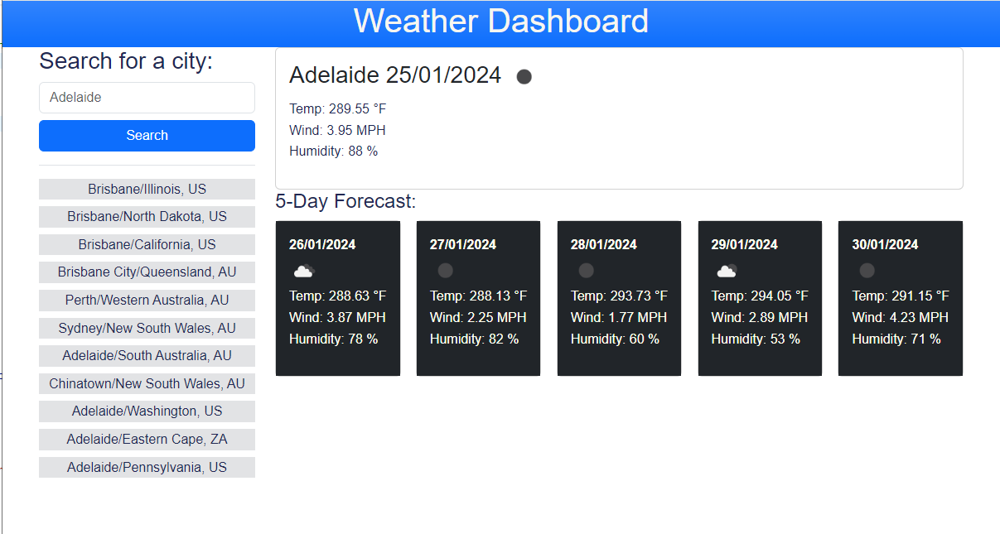
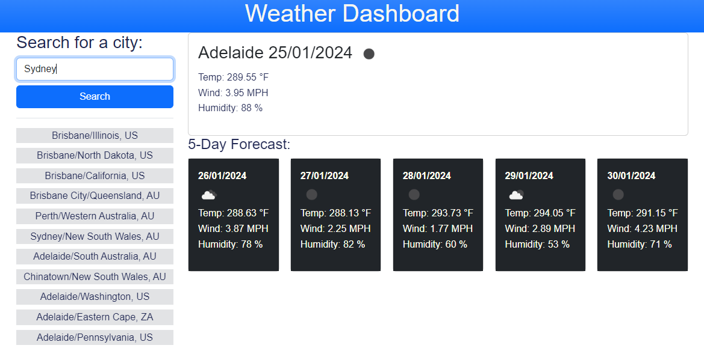
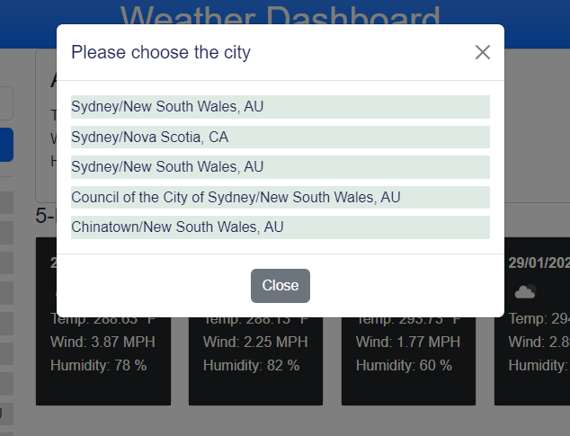

# Weather Dashboard

## Description

This web page was created as a weather dasboard application that allows a user to search 5-day weather forecast for a city and save the city to check weather later. It runs in the browser and feature dynamically updated HTML and CSS.

## Screenshot

## Usage

To view this webpage please follow the link https://dinhn17.github.io/weather-dashboard/

This weather dashboard allows user to see the weather outlook for multiple cities.

When opening in the first time, the application will display 5-day forecast for the Adelaide city. After that, it will display the information of the recently selected city.

To search a city, input the name in the input form, then click on search button. Then the list of 5 similar name cities will be displayed.

If user selects one of the city in the result list, its 5-day weather forecast will be displayed, and that city is added to the search history.

If user clicks on Close button, the application will be back to the main page.

The 5-day weather forecast will include the city name, the date, an icon representation of weather conditions, the temperature, the humidity, and the wind speed.

Instead of searching, user can see the weather forecast of city by clicking on it in the search history.

The data of selected cities will be save in local storage so it will be persisted even user refresh the page.

## Credits

HTML and CSS powered by jQuery, Bootstrap.

Icon is sourced from openweathermap.org.

## License

Please refer to the LICENSE in the repo.
